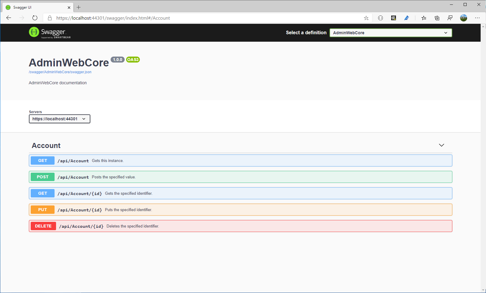

# AdminWebCore
Boilerplate bootstrap admin template for `ASP.NET Core 3.1`.

The project is based on Razor [pages](https://docs.microsoft.com/en-us/aspnet/core/razor-pages/?view=aspnetcore-3.1&tabs=visual-studio). I have already fixed the solution to add `webapi` and document them with **Swagger**.

## Dependecies

- [CoreUI](https://github.com/coreui/coreui-free-bootstrap-admin-template) is free bootstrap admin template
- [NSwag.AspNetCore](https://github.com/RicoSuter/NSwag) to add Swagger to this project (_Startup.cs_ is fixed accordingly). 

## Screenshots

### Dashboard

### Swagger

